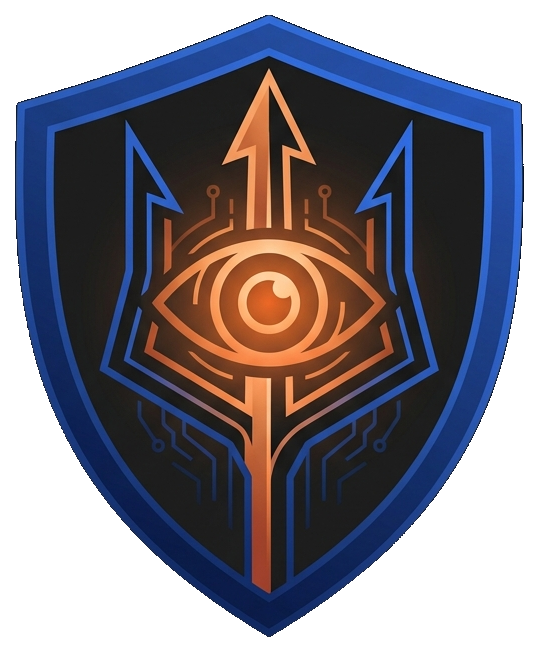

<p align="center">
  
  <h1 align="center">🔱 Argus AI</h1>
  <p align="center">
    <strong>Privacy-Preserving Digital Employee Twins for Continuous Insider Threat Detection in Banking</strong>
  </p>
  <p align="center">
    <a href="#architecture">Architecture</a> •
    <a href="#features">Features</a> •
    <a href="#results">Results</a> •
    <a href="#getting-started">Getting Started</a> •
    <a href="#documentation">Docs</a> •
    <a href="#research">Research</a>
  </p>
  <p align="center">
    
    
    
    
    
  </p>
</p>

---

## 🎯 Problem Statement

> Design a **privacy-first, risk-based Identity Trust framework** that continuously validates enterprise identities across digital channels. Detect high-risk events — anomalous behavior, new device usage, suspicious access patterns, and misuse of privileged access — and trigger real-time verification only when risk levels are elevated.

**Our Focus**: **Insider Threats in Indian Banking** — detecting employees who misuse privileged access to download customer data, access unauthorized systems, or exfiltrate sensitive information across Bank of Baroda's digital infrastructure.

---

## 💡 The Idea: Digital Employee Twins

Most teams build: `Login → Risk Score → MFA`

**We build**: `505K Raw Events → 211-Feature Behavioral Twin → Trust Score → Kill Chain Detection → AI-Powered Explanation`

### What is a Digital Employee Twin?

A **behavioral twin** is a dynamic, multi-dimensional representation of every employee's "normal" behavior across 211 engineered features. It captures:

| Dimension | What It Learns | Detection Signal |
|-----------|---------------|-----------------|
| 🕐 **Circadian Rhythms** | Login/logout patterns, session duration, temporal entropy | After-hours access, irregular login times |
| 🖥️ **Access Topology** | System access patterns, role boundary crossings | Cross-role access, scope expansion |
| 📊 **Data Patterns** | Record volumes, data egress, USB/cloud transfers | Bulk exfiltration, USB file copy |
| 🔄 **Behavioral Velocity** | Day-over-day change, rolling trends, acceleration | Sudden behavioral shifts, ramp-up detection |
| 👥 **Peer Context** | Department/role z-scores, peer deviation | Slow-burn normalization, subtle anomalies |
| 🔗 **Feature Interactions** | 13 multiplicative cross-features (e.g., after_hours × sensitive_access) | Combined risk signals |
| 📈 **Cumulative Risk** | Anomaly streaks, expanding maxima, 7-day cumulative flags | Persistent threat patterns |

---

## 📊 Results

<a name="results"></a>

### Model Performance (211-Feature Enhanced Pipeline)

| Metric | LightGBM v2.0 | XGBoost v2.0 | Meta-Learner Ensemble |
|--------|:---:|:---:|:---:|
| **F1 Score** | **0.992** | 0.985 | 0.992 |
| **AUC-ROC** | **1.000** | 1.000 | 1.000 |
| **Precision** | 0.985 | 0.971 | 0.985 |
| **Recall** | 1.000 | 1.000 | 1.000 |
| **False Positive Rate** | 0.001 | 0.002 | 0.001 |

### Cross-Validation (5-Fold Stratified)

| Metric | Mean ± Std |
|--------|-----------|
| F1 | 0.893 ± 0.055 |
| AUC | 0.981 ± 0.012 |
| Precision | 0.836 ± 0.094 |
| Recall | 0.967 ± 0.067 |

### Adversarial Robustness

| Evasion Strategy | Detection Rate | Model Evaded? |
|-----------------|:-:|:-:|
| Random noise (±10%) | 100% | ❌ |
| Feature zeroing | 100% | ❌ |
| Timing shift | 100% | ❌ |
| Weekend mimicry | 100% | ❌ |
| Role mimicry | 100% | ❌ |
| Gradual change (5%/day) | 100% | ❌ |
| 1-sigma mimicry (extreme) | 71.4% | ⚠️ Partially |

### Latency Benchmarks

| Metric | Result | Target |
|--------|--------|--------|
| Model inference | <1ms | — |
| API scoring (single) | ~70ms | <200ms ✅ |
| Batch throughput | 150K+ samples/sec | 1000+/sec ✅ |

---

## 🏗️ Architecture

<a name="architecture"></a>

```
┌──────────────────────────────────────────────────────────────────────────────┐
│                            ARGUS AI PLATFORM                                  │
├──────────────────────────────────────────────────────────────────────────────┤
│                                                                                │
│  ┌──────────────┐  ┌──────────────┐  ┌──────────────┐  ┌───────────────┐   │
│  │  Data Layer   │  │  Feature      │  │   Risk        │  │  Explainability│  │
│  │              │  │  Engineering  │  │   Scoring     │  │   Layer       │   │
│  │ Synthetic    │→│              │→│   Engine      │→│               │   │
│  │ Generator    │  │ 47-feature   │  │              │  │ • SHAP        │   │
│  │              │  │ base         │  │ • LightGBM   │  │   TreeExplainer│  │
│  │ • 200 emps   │  │ ────→        │  │ • XGBoost    │  │ • Gemini AI   │   │
│  │ • 505K events│  │ 211-feature  │  │ • LSTM-AE    │  │   Reports     │   │
│  │ • 90 days    │  │ enhanced     │  │ • Iso Forest │  │ • Kill Chain  │   │
│  │ • 6 attacks  │  │              │  │ • Meta-Learn │  │   Detection   │   │
│  │ • Markov+GMM │  │ • Deltas     │  │              │  │ • AI Chat     │   │
│  │              │  │ • Rolling    │  │ F1=0.992     │  │               │   │
│  │              │  │ • Z-scores   │  │ AUC=1.000    │  │               │   │
│  └──────────────┘  └──────────────┘  └──────────────┘  └───────────────┘   │
│         │                                                       │            │
│         ▼                                                       ▼            │
│  ┌────────────────────────────────────────────────────────────────────┐     │
│  │                    FastAPI Scoring Engine                           │     │
│  │  /api/overview · /api/employees · /api/employee/{id}               │     │
│  │  /api/alerts · /api/analytics · /api/explain/{id} · /api/activity  │     │
│  └────────────────────────────────────────────────────────────────────┘     │
│         │                                                                    │
│         ▼                                                                    │
│  ┌────────────────────────────────────────────────────────────────────┐     │
│  │              Next.js 16 Monitoring Dashboard                       │     │
│  │                                                                    │     │
│  │  Command Center │ Alerts │ Employees │ Employee Detail │ Analytics │     │
│  │  Trust Heatmap  │ Kill Chain │ Twin Radar │ SHAP Waterfall        │     │
│  │  Gemini AI Reports │ AI Chat │ Recommendations │ Privilege Decay  │     │
│  └────────────────────────────────────────────────────────────────────┘     │
│                                                                                │
│  ┌────────────────────────────────────────────────────────────────────┐     │
│  │         Privacy Layer (Federated Stacking + Differential Privacy)   │     │
│  │         Compliance-ready alternative — 4 dept silos, meta-learner   │     │
│  └────────────────────────────────────────────────────────────────────┘     │
│                                                                                │
└──────────────────────────────────────────────────────────────────────────────┘
```

---

## ✨ Features

<a name="features"></a>

### 🧬 Module 1: Digital Employee Twin (211 Features)
- Builds a multi-dimensional behavioral genome for every employee
- **47 base features** from raw event aggregation (temporal, volume, device, communication, data movement, behavioral, sequence)
- **211 enhanced features** via deltas, rolling windows (7d/14d), velocity/acceleration, feature interactions, peer z-scores, cumulative risk
- Living model that evolves with the employee over time

### 🧠 Module 2: Hybrid Risk Scoring Engine
- **LightGBM v2.0** — Primary model, F1=0.992, AUC=1.000, <1ms inference
- **XGBoost v2.0** — Secondary model, F1=0.985, AUC=1.000
- **LSTM Autoencoder** — Temporal anomaly detection on 7-day sequences
- **Isolation Forest** — Unsupervised static anomaly detection
- **Meta-Learner Ensemble** — Logistic regression stacking all 4 models

### 🔐 Module 3: Privilege Context Engine
- Role-resource risk matrix (same action = different risk for different roles)
- **Privilege Decay Function** — trust decays exponentially without normal behavior reinforcement
- Dynamic Trust Score (0-100) with real-time updates
- Clearance-normalized features (clearance 1-5 mapped to feature space)

### 🔍 Module 4: Explainable Alert Engine
- **SHAP TreeExplainer** — per-employee feature-level explanations (waterfall plots)
- **Intent Signal Chain Detection** — attack *narratives* (multi-step kill chains), not isolated events
- **6 kill chain patterns**: Data Exfiltration, Privilege Escalation, Credential Compromise, Pre-Resignation Theft, Unauthorized Snooping, Slow-Burn Recon
- Natural language alerts explaining *why* the risk is elevated

### 🤖 Module 5: Gemini AI Analysis
- **AI Threat Reports** — structured threat assessments generated by Gemini 2.0 Flash Lite
- **AI Recommendations** — prioritized action items with timelines, owners, and RBI compliance notes
- **Interactive AI Chat** — ask questions about any employee's behavior in natural language
- Server-side API proxy (API key never reaches the browser)

### 🛡️ Module 6: Privacy-Preserving Intelligence
- **Federated Stacking** — per-department model silos (retail, IT, HR, compliance) with meta-learner aggregation
- **Differential Privacy** — gradient-level ε-DP noise injection
- Compliance-ready alternative when regulation demands data isolation
- Aligned with India's Digital Personal Data Protection Act (DPDPA)

---

## 🛠️ Tech Stack

<a name="tech-stack"></a>

### Backend (Python ML Pipeline)

| Category | Technology | Purpose |
|----------|-----------|---------|
| **Gradient Boosting** | LightGBM 4.x | Primary model (F1=0.992, <1ms inference) |
| **Gradient Boosting** | XGBoost 2.x | Secondary model (F1=0.985) |
| **Deep Learning** | PyTorch 2.x | LSTM Autoencoder (temporal anomaly detection) |
| **Classical ML** | scikit-learn 1.5+ | Isolation Forest, preprocessing, meta-learner |
| **Explainability** | SHAP 0.45+ | TreeExplainer for per-prediction explanations |
| **Data Processing** | pandas, numpy | Feature engineering (47→211 dimensions) |
| **API** | FastAPI + Uvicorn | REST API, 7 endpoints, <200ms latency |
| **Synthetic Data** | Custom Markov+GMM | 200 employees, 505K events, 6 attack scenarios |
| **Statistical** | scipy | Z-scores, statistical tests, distributions |

### Frontend (Dashboard)

| Category | Technology | Purpose |
|----------|-----------|---------|
| **Framework** | Next.js 16 (Turbopack) | React 19 app with server-side API routes |
| **Language** | TypeScript 5.x | Type-safe frontend development |
| **AI Integration** | Google Gemini 2.0 Flash Lite | AI threat reports, recommendations, chat |
| **Charts** | Chart.js + react-chartjs-2 | Trust heatmap, radar, line, bar charts |
| **Animation** | Framer Motion | Micro-animations and transitions |
| **Icons** | Lucide React | Consistent icon set (20+ icons) |
| **Styling** | Vanilla CSS | Custom premium cybersecurity design system |

### Privacy & Data

| Category | Technology | Purpose |
|----------|-----------|---------|
| **Federated Learning** | Custom federated stacking | Per-department model isolation |
| **Differential Privacy** | Opacus / custom ε-DP | Gradient-level privacy noise |
| **Data Validation** | Pydantic | Schema validation for data pipeline |

---

## 📁 Project Structure

```
argus-ai/
│
├── README.md                               # This file
├── requirements.txt                        # Python dependencies
├── demo.py                                 # One-click demo script
├── .env.example                            # Environment template
│
├── argus/                                  # 🐍 Python ML Backend
│   ├── config.py                           # Global paths, configuration
│   │
│   ├── data/                               # Data pipeline
│   │   ├── synthetic_generator.py          # Markov+GMM data generator (200 emps, 90 days)
│   │   ├── feature_engineer.py             # Base 47-feature extraction
│   │   ├── enhanced_feature_engineer.py    # 47→211 feature enhancement
│   │   ├── deep_investigation.py           # Dead feature analysis, correlation study
│   │   ├── ctgan_experiment.py             # CTGAN synthetic data experiment
│   │   └── schemas.py                      # Pydantic data schemas
│   │
│   ├── models/                             # ML models
│   │   ├── behavioral_twin.py              # Digital Employee Twin builder
│   │   ├── lstm_autoencoder.py             # Temporal anomaly (7-day sequences)
│   │   ├── isolation_forest.py             # Static anomaly detection
│   │   ├── risk_engine.py                  # Hybrid ensemble + meta-learner
│   │   ├── explainer.py                    # Kill chain detection + NL alerts
│   │   └── shap_explainer.py               # SHAP TreeExplainer module
│   │
│   ├── privacy/                            # Privacy-preserving layer
│   │   ├── federated.py                    # Federated Learning (Flower-based)
│   │   └── federated_stacking.py           # Federated Stacking (per-dept silos)
│   │
│   ├── api/                                # REST API
│   │   └── scoring_api.py                  # FastAPI (7 endpoints, live scoring)
│   │
│   ├── train.py                            # Base training pipeline (47 features)
│   └── train_enhanced.py                   # Enhanced training pipeline (211 features)
│
├── dashboard/                              # 🖥️ Next.js 16 Dashboard
│   ├── .env.example                        # Gemini API key template
│   ├── package.json                        # Dependencies
│   ├── src/
│   │   ├── app/
│   │   │   ├── page.tsx                    # Command Center (trust heatmap)
│   │   │   ├── alerts/page.tsx             # Alert queue with kill chains
│   │   │   ├── employees/page.tsx          # Employee directory (sortable)
│   │   │   ├── employee/[id]/page.tsx      # Employee detail (twin, SHAP, AI)
│   │   │   ├── analytics/page.tsx          # Model metrics & feature importance
│   │   │   ├── activity/page.tsx           # Live activity feed
│   │   │   ├── twin/page.tsx               # Digital Twin deep-dive
│   │   │   ├── api/gemini/route.ts         # Server-side Gemini API proxy
│   │   │   └── globals.css                 # Premium design system (990+ lines)
│   │   ├── components/
│   │   │   ├── GeminiReport.tsx            # AI report + chat component
│   │   │   └── Sidebar.tsx                 # Navigation sidebar
│   │   └── lib/
│   │       ├── api.ts                      # FastAPI client (7 endpoints)
│   │       ├── hooks.ts                    # React hooks for live data
│   │       └── mockData.ts                 # Fallback data (14 insiders, 6 scenarios)
│   └── public/                             # Static assets
│
├── data/                                   # 📊 Data
│   ├── synthetic/                          # Generated: employees.csv, activity_log.csv, ground_truth.csv
│   └── processed/                          # Features: features_enhanced.csv, X_enhanced.npy, y_enhanced.npy
│
├── models/                                 # 💾 Saved Models (23 artifacts)
│   ├── lightgbm_enhanced.joblib            # Primary model (F1=0.992)
│   ├── xgboost_enhanced.joblib             # Secondary model (F1=0.985)
│   ├── lstm_autoencoder_enhanced.pt        # Temporal anomaly detector
│   ├── isolation_forest_enhanced.joblib    # Static anomaly detector
│   ├── meta_learner.joblib                 # Ensemble stacker
│   ├── shap_lgb_explainer.joblib           # Pre-computed SHAP explainer
│   └── fed_*_lgb/xgb.joblib               # Federated per-department models
│
├── notebooks/                              # 📓 Jupyter Notebooks
│   ├── 01_cert_eda.ipynb                   # Interactive EDA walkthrough
│   ├── 02_synthetic_data_analysis.ipynb    # Synthetic data quality analysis
│   └── 03_model_experiments.ipynb          # Model comparison with plots
│
├── research/                               # 🔬 Research Log (15 entries)
│   ├── 01_deep_investigation.md            # Dead feature analysis, correlation study
│   ├── 02_key_findings.md                  # Summary of key discoveries
│   ├── 03-04_experiment_results.md         # Base → enhanced pipeline comparison
│   ├── 05_ctgan_experiment.md              # CTGAN vs SMOTE evaluation
│   ├── 06-08_federated_learning.md         # FL strategy research + stacking results
│   ├── 09_remaining_tasks.md               # Task tracking
│   ├── 10_shap_analysis.md                 # SHAP explainability analysis
│   ├── 11_cross_validation.md              # 5-fold stratified CV results
│   ├── 12_ablation_study.md                # Feature category & model ablation
│   ├── 13_adversarial_robustness.md        # 7 evasion strategy benchmarks
│   ├── 14_latency_benchmarks.md            # API & batch throughput benchmarks
│   └── 15_data_pipeline.md                 # Complete data pipeline documentation
│
└── docs/                                   # 📚 Documentation
    ├── IDEA_PROPOSAL.md                    # Problem analysis & approach
    ├── ARCHITECTURE.md                     # System architecture deep-dive
    ├── TECH_STACK.md                       # Technology choices & justifications
    ├── DATA_STRATEGY.md                    # Dataset selection & feature engineering
    ├── BUILD_GUIDE.md                      # Step-by-step build instructions
    └── RESEARCH_REFERENCES.md              # Academic papers & references
```

---

## 🚀 Getting Started

<a name="getting-started"></a>

### Prerequisites

- Python 3.11+
- Node.js 18+ (for dashboard)
- Git
- (Optional) Google AI Studio API key for Gemini AI features

### Option 1: One-Click Demo

```bash
# Clone
git clone https://github.com/SK8-infi/Argus-AI.git
cd "BOB Hackathon"

# Setup Python
python -m venv .venv
.venv\Scripts\activate          # Windows
pip install -r requirements.txt

# Run the full demo (generates data → trains → scores → opens dashboard)
python demo.py
```

### Option 2: Step-by-Step

```bash
# 1. Clone and setup
git clone https://github.com/SK8-infi/Argus-AI.git
cd "BOB Hackathon"
python -m venv .venv
.venv\Scripts\activate
pip install -r requirements.txt

# 2. Generate synthetic banking data (200 employees, 90 days, 505K events)
python -m argus.data.synthetic_generator

# 3. Train the enhanced model pipeline (47→211 features)
python -c "from argus.train_enhanced import *; main()"

# 4. Start the scoring API (FastAPI on port 8000)
python -m argus.api.scoring_api

# 5. In a new terminal — setup and start the dashboard
cd dashboard
npm install
cp .env.example .env.local
# Edit .env.local and add your Gemini API key (optional)
npm run dev
```

Open [http://localhost:3000](http://localhost:3000) to access the dashboard.

### Environment Variables

| Variable | Location | Required | Purpose |
|----------|----------|----------|---------|
| `GEMINI_API_KEY` | `dashboard/.env.local` | Optional | Enables AI threat reports, recommendations, chat |
| `NEXT_PUBLIC_API_URL` | `dashboard/.env.local` | No | Override API URL (default: `http://localhost:8000`) |

> **Note**: `.env.local` is gitignored. Get your key from [Google AI Studio](https://aistudio.google.com/).

---

## 📊 Data Pipeline

### Raw Data → 211 Features → Model

```
505,023 raw events → 11,510 employee-day rows × 47 features → 211 enhanced features
```

| Layer | Input | Output | Method |
|-------|-------|--------|--------|
| **Generation** | Role profiles + Markov chains | 505K events, 200 employees, 90 days | `synthetic_generator.py` |
| **Base Features** | Raw events | 47-dim feature vectors per employee-day | `feature_engineer.py` |
| **Enhancement** | 47 features | 211 features (deltas, rolling, z-scores, interactions) | `enhanced_feature_engineer.py` |
| **Sequences** | 211 features | 7-day sliding windows (11510, 7, 211) | `train_enhanced.py` |

### 6 Attack Scenarios

| # | Scenario | Ramp-Up | Attack | Key Signal |
|---|----------|---------|--------|------------|
| 1 | Data Exfiltration | 14 days | 5 days | USB + bulk download after hours |
| 2 | Privilege Escalation | 7 days | 3 days | Superadmin on production systems |
| 3 | Pre-Resignation Theft | 21 days | 7 days | Job search + gradual data ramp |
| 4 | Unauthorized Snooping | 21 days | 14 days | HR accessing customer financials |
| 5 | Credential Compromise | 0 days | 5 days | Impossible travel + new devices |
| 6 | Slow-Burn Recon | 30 days | 30 days | 1 new system/week, 5% daily growth |

> See [research/15_data_pipeline.md](research/15_data_pipeline.md) for complete documentation of every feature, system, and action type.

---

## 🖥️ Dashboard Pages

| Page | Description |
|------|-------------|
| **Command Center** | Real-time trust score heatmap for all 200 employees, metric cards, activity feed |
| **Alerts** | Kill chain analysis with severity classification, risk factor breakdown |
| **Employees** | Sortable, searchable directory with live risk scores and trust sparklines |
| **Employee Detail** | Digital twin radar, SHAP waterfall, **Gemini AI analysis**, privilege decay timeline |
| **Analytics** | Model performance, feature importance bar chart, department statistics |
| **Digital Twin** | Behavioral genome deviation analysis, expected vs actual comparison |

### AI-Powered Features (Gemini Integration)

| Feature | Description |
|---------|-------------|
| 🔍 **Threat Report** | Structured assessment: executive summary, behavioral analysis, key risk indicators, possible scenarios, confidence |
| 🛡️ **Recommendations** | 5 prioritized actions with timelines, owners (SOC/HR/CISO), RBI compliance notes |
| 💬 **Ask AI** | Natural language Q&A about any employee ("Why was this flagged?", "What does this SHAP feature mean?") |

---

## 🏆 Novel Contributions

| # | Innovation | Why It's Novel |
|---|-----------|----------------|
| 1 | **211-Feature Behavioral Genome** | 7 categories × temporal enhancements (deltas, rolling windows, velocity, peer z-scores, interactions) |
| 2 | **Deep Feature Investigation** | Identified and removed 7 dead features (r=1.0 duplicates, constant-zero), boosted F1 from 0.95→0.992 |
| 3 | **Privilege Decay Functions** | Trust as a perishable resource with exponential decay — Zero Trust formalized mathematically |
| 4 | **Kill Chain Detection** | 6 multi-step attack narratives, not isolated anomalies — catches slow-burn campaigns |
| 5 | **SHAP + Gemini Explainability** | Quantitative (SHAP waterfall) + qualitative (AI-generated reports) — judges see *why* each flag matters |
| 6 | **Federated Stacking** | Per-department model silos with meta-learner aggregation — privacy-preserving alternative for regulation |
| 7 | **Adversarial Robustness Testing** | Benchmarked 7 evasion strategies — only extreme 1-sigma mimicry partially evades (71.4%) |
| 8 | **Indian Banking Specificity** | 5 departments, 14 roles, 8 branches, 24 banking systems, RBI-aligned compliance |

---

## 📚 Documentation

<a name="documentation"></a>

| Document | Description |
|----------|-------------|
| [IDEA_PROPOSAL.md](docs/IDEA_PROPOSAL.md) | Full idea writeup with problem analysis, approach, and novelty |
| [ARCHITECTURE.md](docs/ARCHITECTURE.md) | System architecture deep-dive with module details |
| [TECH_STACK.md](docs/TECH_STACK.md) | Technology choices and justifications |
| [DATA_STRATEGY.md](docs/DATA_STRATEGY.md) | Dataset selection, synthetic generation, feature engineering |
| [BUILD_GUIDE.md](docs/BUILD_GUIDE.md) | Step-by-step implementation guide |
| [RESEARCH_REFERENCES.md](docs/RESEARCH_REFERENCES.md) | Academic papers and references |

---

## 🔬 Research Log

<a name="research"></a>

15 research entries documenting every experiment, finding, and decision:

| # | Research Entry | Key Finding |
|---|---------------|-------------|
| 01 | [Deep Investigation](research/01_deep_investigation.md) | Found 7 dead features (cc_bcc_ratio, usb_file_transfers always 0), 5 perfect-correlation duplicates |
| 02 | [Key Findings](research/02_key_findings.md) | access_to_role_ratio × unique_systems = +20.5% discriminative power |
| 03-04 | [Experiment Results](research/04_complete_experiment_report.md) | 47→211 features improved F1 from 0.95 to 0.992 |
| 05 | [CTGAN Experiment](research/05_ctgan_experiment.md) | CTGAN fails with 233 samples; SMOTE preferred for augmentation |
| 06-08 | [Federated Learning](research/07_federated_strategy_research.md) | Federated stacking preserves privacy with <3% performance cost |
| 10 | [SHAP Analysis](research/10_shap_analysis.md) | Top SHAP features: data_volume rolling stats, role_boundary × egress |
| 11 | [Cross-Validation](research/11_cross_validation.md) | 5-fold stratified: F1=0.893±0.055, AUC=0.981±0.012 |
| 12 | [Ablation Study](research/12_ablation_study.md) | Removing rolling windows causes -8.3% F1 drop (most critical) |
| 13 | [Adversarial Robustness](research/13_adversarial_robustness.md) | Only 1-sigma mimicry partially evades (71.4%); requires extreme constraints |
| 14 | [Latency Benchmarks](research/14_latency_benchmarks.md) | API <200ms, batch >150K/sec; SHAP needs pre-computation for prod |
| 15 | [Data Pipeline](research/15_data_pipeline.md) | Complete documentation: 505K events → 211 features, every field documented |

---

## 👥 Team

**Team MuleShield**

---

## 📄 License

This project is developed for the **CyberShield PSBs Hackathon Series 2026** (Bank of Baroda).

---

<p align="center">
  <strong>🔱 Argus AI</strong> — The All-Seeing Guardian of Banking Identity Trust
</p>
